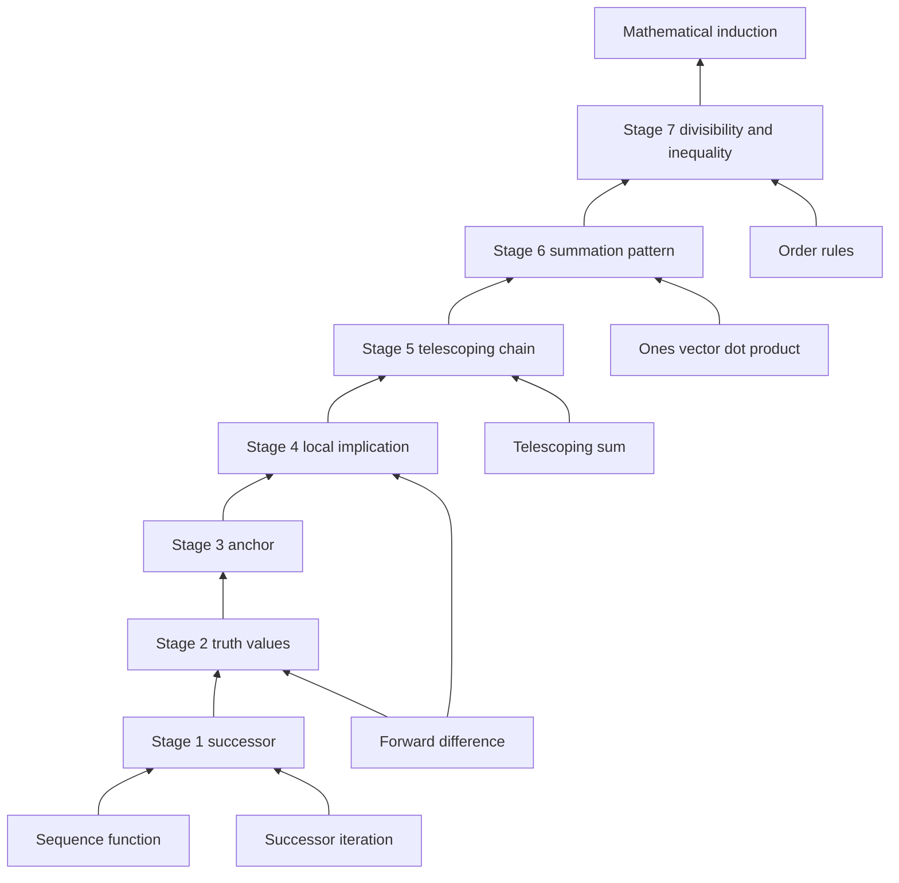

<!-- REVISION NOTES: mathematical_induction_bottom_up_v2.md -->
<!-- Generated by: bottom-up (post-audit patch pass) -->
<!-- Original: mathematical_induction_bottom_up.md (unchanged) -->
<!-- Audit report: mathematical_induction_bottom_up_explanation_audit.md -->
<!--                                                              -->
<!-- CHANGES FROM ORIGINAL:                                       -->
<!-- #1 [minor] section 1 route preview — name the preview words as labels, not definitions -->
<!-- #2 [moderate] stage 4 construction — spell out that the hypothesis alone does not force the next truth value -->
<!-- #3 [moderate] stage 6 construction — say the first equality spends the inductive hypothesis -->
<!-- #4 [moderate] stage 7 construction — split divisibility by 6 into the factor 2 and the factor 3 -->
<!-- ============================================================  -->

# 數學歸納法入門：由數列與差分建到原理

香港 DSE M2 入門。英文標題是技能檢查器要認的骨架，正文用繁體中文。

## 1. Destination and Why It Matters

目標是數學歸納法這件工具：要證明一句話對每一個正整數 $n$ 都成立，就驗證起點，再證明「若它在 $k$ 成立，則在 $k+1$ 也成立」。

它解決的痛處是：正整數有無限個，不能逐個代進去。只驗 $n=1,2,3$ 永遠留著下一個沒驗的數。

路線是：我們從數列、後繼映射、前向差分、望遠鏡求和、全一向量的點積，以及不等式的保序出發；接著做出真值數列、起點錨、局部蘊涵和把這些蘊涵加起來的鏈；最後才把這條鏈叫作數學歸納法，並用它證明求和、整除與不等式。

真值數列、起點錨、局部蘊涵這些詞現在只是路標。它們的定義要到第 3 節的對應階段才出現，這裡還沒有把它們當成已經證明的物件。

## 2. Foundation Layer (Calculus and Linear Algebra Only)

這一層只用單變量微積分裡的數列與求和，以及線性代數裡的向量點積。不使用拓撲、測度或抽象代數。

### Primitive 1: 數列是定義在正整數上的函數

**What it is:** 數列是一個 function，定義域 domain 是正整數集合 $\{1,2,3,\ldots\}$，值是實數。第 $n$ 項就是這個 function 在 $n$ 的值。

**Why it is load-bearing:** 歸納法要談的是「每一個正整數上的一句話」。沒有這個 function，就沒有可沿著 $n$ 移動的對象。

**Tiny concrete example:** 取 function $a(n)=n^2$。則 $a(1)=1$，$a(2)=4$，$a(3)=9$。

### Primitive 2: 後繼映射與其迭代

**What it is:** 後繼是一個 map $S$，把每個正整數送到下一個：$S(n)=n+1$。迭代就是把這個 map 再做一次。

**Why it is load-bearing:** 歸納步驟不是一次跳到任意的 $n$，而是只允許走這個 map 的一步。

**Tiny concrete example:** $S(4)=5$，再做一次 $S(S(4))=6$。從 $4$ 走到 $6$ 用了兩步，不是一步。

### Primitive 3: 前向差分

**What it is:** 對數列 $s$，前向差分是 $\Delta s(n)=s(n+1)-s(n)$。它是導數的離散版本：只比較相鄰兩項。

**Why it is load-bearing:** 「由 $k$ 到 $k+1$ 改變了什麼」就是一個差分。歸納步驟要控制的就是這個差，而不是整個公式的外形。

**Tiny concrete example:** $s(n)=n^2$ 時，$\Delta s(1)=4-1=3$，$\Delta s(2)=9-4=5$。

### Primitive 4: 望遠鏡求和

**What it is:** 把差分加回去，中間項抵消，得到 $s(n)-s(1)=\Delta s(1)+\Delta s(2)+\cdots+\Delta s(n-1)$。這是微積分裡望遠鏡級數的有限版。

**Why it is load-bearing:** 若每一步的差分都把「已經成立」傳給下一項，把這些差分加起來，就得到從起點到任意 $n$ 的全局結論。

**Tiny concrete example:** $s(n)=n$，則每個差分都是 $1$。$s(4)-s(1)=3$，而 $1+1+1=3$。

### Primitive 5: 向量與全一向量的點積

**What it is:** 前 $n$ 項可以排成 $\mathbb{R}^n$ 裡的一個向量。把它和全是 $1$ 的向量做點積，就是把分量相加。

**Why it is load-bearing:** 求和公式不是新的魔法，它是這個點積的一個閉式。歸納法要檢查的是：向量每加長一維，閉式是否仍然等於點積。

**Tiny concrete example:** 向量 $(1,2,3)$ 與 $(1,1,1)$ 的點積是 $1+2+3=6$。

### Primitive 6: 不等式的保序

**What it is:** 若 $A\ge B$ 且 $C\ge 0$，則 $A+C\ge B+C$。若 $A\ge B$ 且倍數 $m\ge 0$，則 $mA\ge mB$。這是微積分裡比較大小時用的順序規則。

**Why it is load-bearing:** 不等式型的歸納步驟不是等式變形，而是把已知的大小關係乘上一個非負數或加上一個非負數。

**Tiny concrete example:** $5\ge 3$ 且 $2\ge 0$，所以 $5+2\ge 3+2$，即 $7\ge 5$。同樣 $2\cdot 5\ge 2\cdot 3$，即 $10\ge 6$。

## 3. Bottom-Up Thinking Stages

### Stage 1: 只允許走後繼這一步

Stage output: 後繼 map $S(n)=n+1$，作為從一個下標走到下一個下標的唯一合法動作。

**Motivation**:

Bottleneck: 正整數集合上看起來可以從 $1$ 直接跳到 $100$，但那樣一步裡塞了 $99$ 個沒有解釋的空隙。

Why-now trigger: 數列已經是一個 function，可是 function 本身不說明相鄰兩項如何相關。

Rejected shortcut: 直接寫「對所有 $n$ 都成立」而不指出 $n$ 怎樣增加。這句話沒有計算內容。

Stage objective: 把「下一個」固定成 map $S$。

Payoff signal: 之後每一個證明步驟都可以說成「沿 $S$ 走一步」。

**Intuition**:

Mental model: 正整數是一列站，列車每次只准停靠下一站。$S$ 是時刻表，不是終點站的名字。

Where it fails: 如果命題在偶數和奇數上要不同的跳躍，單靠 $S(n)=n+1$ 仍不夠，必須把那兩種情況寫進同一步裡。它不會自動處理。

**Construction step**:

Uses: Primitive 1 的數列 function 與 Primitive 2 的迭代 map。

Assumptions: 定義域 domain 是正整數，而且每個正整數都有下一個。

Artifact produced: map $S(n)=n+1$。

檢查一步的定義：

$$S(n)=n+1.$$

**Worked example**:

Setup: function $a$ 的 domain 是正整數，規則 $a(n)=2n$。map $S(n)=n+1$。

Compute: $S(3)=3+1=4$，然後 $a(S(3))=2\cdot 4=8$。

Interpret: 先移動下標，再讀函數值。兩件事不是同一件事。

Common mistake: 把 $a(n+1)$ 寫成 $a(n)+1$。這裡 $a(3)=6$，但 $a(4)=8$，不是 $7$。

Sanity check: $a(3)+2=8$，多出來的 $2$ 來自斜率，不是來自 $S$ 本身。

Setup: set $\{1,2,3,4\}$ 上的 map $T(n)=n+1$，但 $4$ 的下一個不在這個 set 裡。

Compute: $T(1)=2$，並且 $T(2)=3$。$T(4)$ 沒有落在這個 set 中。

Interpret: 後繼 map 需要定義域對「下一個」封閉。有限 set 的最後一點會讓迭代停住。

Common mistake: 在有限 set 上檢查了幾步，就宣稱無限的正整數也都走得通。

Sanity check: 從 $1$ 迭代三次得到 $T(T(T(1)))=4$，第四次就離開這個 set。

**What this unlocks next**:

Remaining gap: 有了步伐，還沒有把「一句要證明的話」放在每個站上。

Next question: 怎樣把依賴 $n$ 的命題記成一條可以相減的數列？

Dependency edge: stage_1 -> stage_2: 後繼 map 給出放置命題的下一格

### Stage 2: 命題是一條 0-1 數列

Stage output: 真值 function $t$，其中 $t(n)=1$ 表示 $P(n)$ 為真，$t(n)=0$ 表示為假。

**Motivation**:

Bottleneck: 「$P(n)$ 成立」仍是一句中文。不能對一句中文做差分。

Why-now trigger: Stage 1 已經有站與步伐，缺的是每個站上的讀數。

Rejected shortcut: 用一個例子的數字代替命題。$n=3$ 時 $3^2=9$ 只是 function 的值，不是「對所有 $n$，$n^2\ge n$」這句話。

Stage objective: 把命題壓成取值 $0$ 或 $1$ 的數列。

Payoff signal: $\Delta t(n)=0$ 且 $t(n)=1$ 就表示真值被帶到下一站。

**Intuition**:

Mental model: $t$ 是一排燈。燈亮是 $1$，燈滅是 $0$。歸納法是在說明燈怎樣保持亮著。

Where it fails: 若 $P(n)$ 不是對錯分明的句子，例如「$n$ 比較漂亮」，就沒有這個 function。歸納法不適用。

**Construction step**:

Uses: stage_1 的後繼，以及 Primitive 1 的 function 概念。此處才定義符號 $P(n)$ 與 $t(n)$。

Assumptions: 對每個正整數 $n$，$P(n)$ 要麼真要麼假。

Artifact produced: function $t:\{1,2,3,\ldots\}\to\{0,1\}$。$P(n)$ 為真時 $t(n)=1$，否則 $t(n)=0$。

$$t(n)\in\{0,1\}.$$

**Worked example**:

Setup: set 的陳述 $P(n)$ 是「$n$ 是偶數」。function $t$ 的 domain 是正整數。

Compute: $t(1)=0$，因為 $1$ 不是偶數；接著 $t(2)=1$，因為 $2=2\cdot 1$。

Interpret: 這條真值數列是 $0,1,0,1,\ldots$，不是一條一旦亮了就保持亮的數列。

Common mistake: 看到 $t(2)=1$ 就說從 $2$ 起全部為真。$t(3)=0$ 立刻否定它。

Sanity check: $\Delta t(2)=t(3)-t(2)=0-1=-1$，真值在後繼這一步掉下去了。

Setup: function $b(n)=n(n+1)$，命題 $Q(n)$ 是「$2$ 整除 $b(n)$」。map 仍是 $S(n)=n+1$。

Compute: $b(1)=1\cdot 2=2$，所以 $t(1)=1$；然後 $b(2)=2\cdot 3=6$，所以 $t(2)=1$。

Interpret: 前兩站都亮，仍只是資料。它還沒解釋 $t(3)$。

Common mistake: 把 $b(n)$ 的偶性當成不需要證明的「看就知道」。看只覆蓋了你算出來的那些 $n$。

Sanity check: $b(3)=12$ 仍被 $2$ 整除，所以 $t(3)=1$，但這是多算一項，不是從 $t(2)$ 推來的。

**What this unlocks next**:

Remaining gap: 燈可以全滅。有數列不代表起點是亮的。

Next question: 哪一個數值把鏈的第一站固定住？

Dependency edge: stage_2 -> stage_3: 真值 function 需要一個起始讀數

### Stage 3: 用起點把真值釘住

Stage output: 基礎錨 $t(n_0)=1$，入門時通常 $n_0=1$。

**Motivation**:

Bottleneck: 若每一站都只說「假如上一站是亮的」，整條鏈可以全部是滅的。

Why-now trigger: Stage 2 的 $t$ 已經有定義，但 $t(1)$ 可以是 $0$。

Rejected shortcut: 說「$n$ 很小的時候顯然成立」而不算出 $t(1)$。顯然不是數值。

Stage objective: 規定並核對起點的真值。

Payoff signal: 鏈有了第一個確定的 $1$。

**Intuition**:

Mental model: 錨是碼頭上的第一根樁。後面的繩子拉得再緊，樁本身沒打進去，船還是漂的。

Where it fails: 有些命題從 $n=1$ 就是假的，例如「$2^n\le n$」。錨算完是 $0$，後面的步驟即使寫對也不能開始。

**Construction step**:

Uses: stage_2 的真值 function $t$。

Assumptions: 起點 $n_0$ 在 domain 裡，而且 $P(n_0)$ 可以在有限步內直接計算。

Artifact produced: 陳述 $t(n_0)=1$。

$$t(1)=1.$$

**Worked example**:

Setup: function $s(n)=n(n+1)/2$，命題 $P(n)$ 是 $1+\cdots+n=s(n)$。domain 從 $1$ 開始。

Compute: 左邊在 $n=1$ 只有一項，所以 $1=1$；右邊 $s(1)=1\cdot 2/2=1$。

Interpret: $t(1)=1$。錨釘住了，但 $n=2$ 還沒有被這個等式管到。

Common mistake: 把 $s(1)=1$ 當成已經證明了所有 $n$。右邊的閉式在 $n=1$ 成立，只是起點。

Sanity check: $s(2)=3$，而 $1+2=3$，這是另一個直接計算，不是錨本身。

Setup: 命題 $R(n)$ 是 $2^n\le n$。function 是指數 function $e(n)=2^n$，domain 為正整數。

Compute: $e(1)=2$，而 $2\le 1$ 不成立，所以 $t(1)=0$。接著 $e(2)=4$，而 $4\le 2$ 仍不成立。

Interpret: 錨是 $0$。這條命題不能用從 $n=1$ 出發的歸納法去證明，因為它是假的。

Common mistake: 跳過起點，直接寫歸納步驟。步驟再漂亮也不能把 $0$ 變成定理。

Sanity check: 若有人改口說從 $n=4$ 開始，$2^4=16$ 仍然大於 $4$，錨依舊是 $0$。

**What this unlocks next**:

Remaining gap: 只有第一盞燈。第二盞燈不會因為第一盞燈而自動亮。

Next question: 哪一種局部規則能把 $1$ 從 $k$ 抄到 $k+1$？

Dependency edge: stage_3 -> stage_4: 錨給出鏈的第一個 1，但沒有傳遞規則

### Stage 4: 局部蘊涵是一條遞推

Stage output: 規則「若 $t(k)=1$，則 $t(k+1)=1$」。

**Motivation**:

Bottleneck: 錨只固定一點。差分 $\Delta t(k)$ 仍可能是 $-1$。

Why-now trigger: Stage 3 之後，自然的問題就是相鄰兩站的讀數如何相關。

Rejected shortcut: 假設 $P(k)$ 之後直接寫「所以 $P(k+1)$」，中間不改寫式子。那是把結論重複一遍。

Stage objective: 把傳遞寫成一個可以檢查的蘊涵，並用代數或順序規則證明它。

Payoff signal: 在假設 $t(k)=1$ 之下，得到 $\Delta t(k)=0$。

**Intuition**:

Mental model: 這是一條只負責相鄰兩站的合約。合約不談論 $100$ 號站，除非你把合約執行 $99$ 次。

Where it fails: 若從 $P(k)$ 推出的是 $P(k+2)$ 而不是 $P(k+1)$，合約和後繼 map 對不上，奇偶會裂開。

**Construction step**:

Uses: stage_3 的錨作為動機，stage_1 的 map $S$，以及 Primitive 3 的差分。證明蘊涵時才用到 Primitive 6 或展開。

Assumptions: $k$ 是任意已固定的正整數，而且 $P(k)$ 被假設為真。不假設 $P(k+1)$。

Artifact produced: 蘊涵 $t(k)=1 \Rightarrow t(S(k))=1$。

在該假設下差分消失：

$$\Delta t(k)=t(k+1)-t(k)=0.$$

假設本身只固定 $t(k)=1$。必須先證明蘊涵，才得到 $t(k+1)=1$。兩個值都是 $1$ 之後，差分才是 $0$。

**Worked example**:

Setup: function $s(n)=n(n+1)/2$。假設 $t(k)=1$，即 $1+\cdots+k=s(k)$。要到達 $S(k)=k+1$。

Compute: $1+\cdots+(k+1)=s(k)+(k+1)=k(k+1)/2+(k+1)=(k+1)(k+2)/2$。

Interpret: 末項被加進舊和，新式子正好是 $s(k+1)$。所以 $t(k+1)=1$。

Common mistake: 在假設裡就寫下 $1+\cdots+(k+1)=s(k+1)$。那是目標，不是已知。

Sanity check: 取 $k=1$。已知和是 $1$，加上 $2$ 得 $3$，而 $s(2)=3$。一步成立。

Setup: function $p(n)=2^n$，命題是 $p(n)\ge n+1$。假設 $t(k)=1$，即 $2^k\ge k+1$。

Compute: $2^{k+1}=2\cdot 2^k\ge 2(k+1)=2k+2$，而且 $2k+2\ge k+2$，因為 $k\ge 0$。

Interpret: 乘上 $2$ 用了保序，最後再放下多餘的 $k$。這證明的是蘊涵，不是起點。

Common mistake: 從 $2^k\ge k+1$ 直接寫 $2^{k+1}\ge k+2$，省掉 $2(k+1)$。少了中間比較，看不出多出來的 $k$ 被丟掉。

Sanity check: $k=3$ 時 $2^3=8\ge 4$，而 $2^4=16\ge 5$。規則給出 $16\ge 2\cdot 4=8$，而 $8\ge 5$，確實還有富餘。

**What this unlocks next**:

Remaining gap: 一張只談相鄰兩站的合約，還沒有走到任意的 $n$。

Next question: 把合約執行 $n-n_0$ 次，為什麼中間不會漏站？

Dependency edge: stage_4 -> stage_5: 局部蘊涵變成可以重複相加的差分

### Stage 5: 用望遠鏡把步驟加成原理

Stage output: 數學歸納法的鏈：若 $t(n_0)=1$ 且每一步 $\Delta t=0$，則對所有 $n\ge n_0$ 都有 $t(n)=1$。

**Motivation**:

Bottleneck: 局部合約的變數叫 $k$，結論卻要對任意 $n$。兩者之間差了很多次後繼。

Why-now trigger: Stage 4 給出 $\Delta t(k)=0$，而 Primitive 4 已經知道差分加起來會還原函數值。

Rejected shortcut: 說「然後依此類推」。類推沒有寫出被加起來的那些 $0$。

Stage objective: 把從 $n_0$ 到 $n$ 的每一步蘊涵排成一條和，並看到真值不變。

Payoff signal: 得到一個對所有 $n\ge n_0$ 的陳述，而且每一步都能指回 Stage 4。

**Intuition**:

Mental model: 望遠鏡求和。$t(n)-t(n_0)$ 等於中間那些差分的和。每個差分都是 $0$，所以 $t(n)$ 等於錨。

Where it fails: 只要有一個 $k$ 的蘊涵沒被證明，$\Delta t(k)$ 就不能放進和裡。漏一站，望遠鏡就斷開。

**Construction step**:

Uses: stage_4 的蘊涵，以及 Primitive 4 的望遠鏡求和。

Assumptions: 錨 $t(n_0)=1$，而且對每一個 $k\ge n_0$，Stage 4 的蘊涵都已證明。$n$ 是任意大於或等於 $n_0$ 的正整數。

Artifact produced: 原理的工作形式 $t(n)=1$。

$$t(n)-t(n_0)=\Delta t(n_0)+\cdots+\Delta t(n-1)=0.$$

因此 $t(n)=t(n_0)=1$。這就是入門程度的數學歸納法。

**Worked example**:

Setup: domain 為正整數的 function $t$，錨 $t(1)=1$，而且對 $k=1,2$ 已經知道 $\Delta t(k)=0$。目標只到 $n=3$。

Compute: $t(3)-t(1)=\Delta t(1)+\Delta t(2)=0+0=0$，所以 $t(3)=t(1)=1$。

Interpret: 兩步差分都是 $0$，第三站的真值被錨決定，不需要再單獨「相信」它。

Common mistake: 只加 $\Delta t(1)$ 就宣稱 $t(3)=1$。那樣只到達 $t(2)$。

Sanity check: $t(2)=t(1)+\Delta t(1)=1$。再加一次才到 $t(3)$。

Setup: 同一個 function，但假設有人只證明了 $k\ge 2$ 的蘊涵，沒有證明 $k=1$。set 的起點仍然是 $t(1)=1$。

Compute: 不能寫 $\Delta t(1)=0$。正確的一步本應是 $t(2)-t(1)=\Delta t(1)$，但這一項沒有被證明，所以 $t(5)-t(1)$ 的展開式缺第一段。

Interpret: 後面的合約再完整，第一段斷了，望遠鏡就不能從錨出發。

Common mistake: 用 $k=5$ 的漂亮計算填補 $k=1$ 的空隙。不同的 $k$ 是不同的一步。

Sanity check: 若改把錨放在 $n_0=2$ 並且 $t(2)=1$，則鏈可以從 $2$ 走到 $5$，但不再包括 $n=1$。

**What this unlocks next**:

Remaining gap: 原理還是抽象的 $t$。它還沒在一條具體的求和公式上走完。

Next question: 怎樣把「加上最後一項」寫成 Stage 4 的那一種蘊涵？

Dependency edge: stage_5 -> stage_6: 鏈允許我們把一個求和閉式從 k 推到 k+1

### Stage 6: 求和公式是鏈的第一個回報

Stage output: 證明 $1+\cdots+n=n(n+1)/2$ 的歸納書寫格式。

**Motivation**:

Bottleneck: 學生會背公式，但說不出為什麼 $n$ 換成 $n+1$ 時公式仍然對。

Why-now trigger: Stage 5 的鏈需要一個差分不是抽象 $0$、而是「舊和加上一項」的例子。

Rejected shortcut: 用全一向量的點積直接背出 $6$，然後說 $n$ 的情況也一樣。一個向量的點積不是證明。

Stage objective: 把 Primitive 5 的「向量加長一維」寫成歸納步驟。

Payoff signal: 閉式在 $k+1$ 被算出來，而且等於新的點積。

**Intuition**:

Mental model: 長度為 $k$ 的向量與全 $1$ 向量的點積已知。加長一維就是在點積上加最後一個分量。閉式必須增加同一個分量。

Where it fails: 如果最後一項不是 $k+1$，而是 $k^2$，你卻仍然加上 $k+1$，新的點積和閉式就會分開。

**Construction step**:

Uses: stage_5 的鏈，Primitive 5 的點積，以及 stage_4 裡已經算過的一步代數。

Assumptions: 基礎錨 $n=1$ 已在 Stage 3 算過。歸納假設只假設長度 $k$ 的向量點積等於 $k(k+1)/2$。

Artifact produced: 對每個正整數 $n$，$1+\cdots+n=n(n+1)/2$。

第一個等號使用歸納假設：前 $k$ 項換成 $k(k+1)/2$，只把新的一項 $k+1$ 留在外面。

$$1+\cdots+(k+1)=\frac{k(k+1)}{2}+(k+1)=\frac{(k+1)(k+2)}{2}.$$

**Worked example**:

Setup: 向量 $v=(1,2,3,4)$，全一向量 $u=(1,1,1,1)$。function $s(n)=n(n+1)/2$。比較 $n=4$ 與前三項。

Compute: $v\cdot u=1+2+3+4=10$，而 $s(4)=4\cdot 5/2=10$。前三項的點積是 $6=s(3)$，加上 $4$ 得 $10$。

Interpret: 四維點積等於三維點積加最後分量。這就是步驟在 $k=3$ 的一個數值樣本。

Common mistake: 用 $1+2+3+4=10$ 同時當成所有 $n$ 的證明。這個向量只是 $n=4$。

Sanity check: $s(3)+4=6+4=10=s(4)$。加項與閉式的增量一致。

Setup: 錯誤的閉式 function $w(n)=n^2$。domain 仍是正整數。假設有人宣稱 $1+\cdots+n=w(n)$。

Compute: 錨 $w(1)=1$ 碰巧等於 $1$。但 $w(1)+2=3$，而 $w(2)=4$，兩者不相等。

Interpret: 錨可以是真的，步驟仍然失敗。鏈在第一 walk 之後就斷了。

Common mistake: 只檢查 $n=1$ 就接受一個閉式。Stage 3 的錨通過，不等於 Stage 4 的合約通過。

Sanity check: $1+2=3\neq 4$。一個反例就夠把 $w$ 排除。

**What this unlocks next**:

Remaining gap: 求和用的是「加上一項」。整除與不等式的 $P(k+1)$ 不是一個和。

Next question: 同一條鏈怎樣搬到整除和大小比較？

Dependency edge: stage_6 -> stage_7: 書寫格式留著，只換 P(k+1) 的代數內容

### Stage 7: 同一條鏈搬到整除與不等式

Stage output: 入門原理的正式使用範圍：求和、整除、不等式三種 $P(n)$，步驟的代數不同，鏈相同。

**Motivation**:

Bottleneck: 學生把歸納法當成求和專用技巧。一見到「證明 $6$ 整除 $n^3-n$」就換一套不相關的格式。

Why-now trigger: Stage 6 的格式已經穩定，值得看見 $P(k+1)$ 可以是整除關係或不等式。

Rejected shortcut: 用因式 $(n-1)n(n+1)$ 直接說明被 $6$ 整除，然後說這就是歸納法。那是另一條證明，沒有使用錨和步驟。

Stage objective: 用同一條 Stage 5 的鏈寫出整除與不等式，並把原理收成一句定義。

Payoff signal: 三種題的紙面都分成基礎、假設、步驟、結論，只有步驟中間的式子不同。

**Intuition**:

Mental model: 鏈是輸送帶。輸送帶不變，放上去的箱子可以是等式、整除或不等式。

Where it fails: 箱子本身算錯時，輸送帶不會訂正它。$(k+1)^3-(k+1)$ 展開漏項，整除步驟就失敗，即使格式正確。

**Construction step**:

Uses: stage_6 的書寫格式、stage_5 的鏈、Primitive 6 的保序，以及展開 $(k+1)^3$。

Assumptions: $n$ 是正整數。整除題的 $P(n)$ 是「$6$ 整除 $n^3-n$」。不等式題的 $P(n)$ 是 $2^n\ge n+1$。

Artifact produced: 可遷移的原理陳述，而不是第二條不同的原理。

整除步驟的核心差：

$$(k+1)^3-(k+1)=k^3+3k^2+3k+1-k-1=(k^3-k)+3k(k+1).$$

$3k(k+1)$ 含有相鄰兩整數，所以被 $6$ 整除。假設 $6$ 整除 $k^3-k$ 之後，和仍然被 $6$ 整除。

$k$ 與 $k+1$ 是連續整數，其中一個是偶數，所以 $2$ 整除 $k(k+1)$。式子裡已經有因數 $3$，因此 $6$ 整除 $3k(k+1)$。

**Worked example**:

Setup: function $f(n)=n^3-n$。命題是 $6$ 整除 $f(n)$。先做錨，再做 $k=1$ 的一步。

Compute: $f(1)=1-1=0$，而 $6\cdot 0=0$，所以錨為真。接著 $f(2)=8-2=6$，並且 $6=6\cdot 1$。

Interpret: $n=2$ 可以被直接算出來，也可以看成 $f(1)+3\cdot 1\cdot 2=0+6$。兩種算法一致。

Common mistake: 說 $0$ 不能被 $6$ 整除。$0=6\cdot 0$，它可以被整除。

Sanity check: $f(3)=27-3=24=6\cdot 4$。第三項也成立，但仍只是樣本，樣本支持的是步驟裡的增量 $3k(k+1)$。

Setup: function $p(n)=2^n$ 與比較 function $c(n)=n+1$。命題 $p(n)\ge c(n)$。

Compute: 錨 $p(1)=2$ 且 $c(1)=2$，所以 $2\ge 2$。步驟在 $k=1$：$2^{2}=2\cdot 2=4$，而 $2(1+1)=4$，且 $4\ge 3$。

Interpret: 起點相等。步驟先把兩邊乘 $2$，得到比 $c(2)=3$ 更大的 $4$，所以不等式仍然成立。

Common mistake: 錨用 $2\ge 2$，步驟卻寫成嚴格大於 $2^{k+1}>k+2$ 並拿錨的等號去充當嚴格不等號。等號在起點是允許的。

Sanity check: $p(3)=8$，$c(3)=4$，$8\ge 4$。富餘變大，與「乘 $2$ 之後丟掉一個正的 $k$」一致。

**What this unlocks next**:

Remaining gap: 三種題都走同一條鏈，但鏈本身還沒有被收成可以單獨背誦的定義句。下一節就把這句話說乾淨。

Next question: 哪句話是定義，哪種「驗很多個 $n$」其實不是證明？

Dependency edge: stage_7 -> destination: 三種題共用的錨加步驟被收成數學歸納法

## 4. Assembly Snapshot

foundation primitives -> 後繼 map 與真值 function -> 錨與局部蘊涵 -> 望遠鏡鏈 -> 求和、整除、不等式 -> destination 數學歸納法。

## 5. Final Concept/Theorem Statement

Formal definition: 設 $P(n)$ 是依賴正整數 $n$ 的命題，真值 function 為 $t$。若存在起點 $n_0$ 使 $t(n_0)=1$，而且對每個 $k\ge n_0$，由 $t(k)=1$ 可以推出 $t(k+1)=1$，則對所有 $n\ge n_0$ 都有 $t(n)=1$。入門書寫把這四段分成基礎步驟、歸納假設、歸納步驟、結論。

Near-miss non-example: 算出 $n=1,2,3,4$ 都成立，並沒有證明第 $5$ 個之後。那是四個錨的並列，缺少從 $k$ 到 $k+1$ 的合約，所以不是數學歸納法。

Wrong mental model: 歸納假設是「先承認全部結論」，所以證明是循環的。

Correction: 假設只借走一個固定的 $k$，要還的是 $k+1$。沒有 Stage 4 的那一次代數，假設不能被使用。全部 $n$ 的結論是 Stage 5 把許多個這樣的一步加起來之後才出現的，不是假設裡原本就有的。

## 6. How the Thinking Process Could Have Invented It

數列讓我們有東西可沿著 $n$ 讀。只讀函數值不夠，因為要證明的是一句話，所以把話壓成 $0$ 和 $1$。$0$ 和 $1$ 仍可能在起點就是 $0$，於是必須先釘錨。錨不動，於是寫相鄰兩站的合約。一張合約到不了任意 $n$，而望遠鏡求和本來就會把相鄰差分加回函數值，於是把每一個 $\Delta t(k)=0$ 加起來。這不是先背下原理再找例子，而是差分加不回去的時候，人們不得不把「每一步都成立」寫成前提。

Naive attempt: 只計算前十個正整數，然後說後面也一樣。這個做法 breaks，因為第 $11$ 個數沒有被任何合約管到。十個真值是十個孤立的錨，望遠鏡裡沒有那些 $\Delta t(k)=0$ 的項，所以和不存在。

另一個失敗的走法是：一開始就要求一條閉式。很多整除命題沒有比「被 $6$ 整除」更短的閉式。沒有閉式時，這種走法 does not work。歸納法要的不是更短的公式，而是一步能傳遞的差分。

## 7. Downstream Growth from the Same Elementary Ideas

- Name: 平方和公式 $1^2+\cdots+n^2=n(n+1)(2n+1)/6$
- Foundation ideas reused: 望遠鏡思想的鏈、全一向量點積的「加長一維」、以及 $(k+1)^2$ 的展開
- Reason it depends: 它 depends on 同一條錨加步驟，只是新向量的分量是平方而不是 $k$ 本身
- Suggested next command: `/concept sum of squares by induction`

- Name: 等比求和 $1+r+\cdots+r^{n}$
- Foundation ideas reused: 數列 function 與後繼 map；步驟是乘上 $r$ 而不是加上 $k+1$
- Reason it depends: 它 depends on 局部合約仍是相鄰兩項，只是增量變成 $r^{k+1}$
- Suggested next command: `/concept geometric series by induction`

- Name: 二項式係數的帕斯卡恆等式歸納
- Foundation ideas reused: 差分的相鄰比較，以及向量分量滿足 $C(k+1,m)=C(k,m)+C(k,m-1)$ 這種加法
- Reason it depends: 它 depends on 把組合數的遞推當成 Stage 4 的蘊涵
- Suggested next command: `/theorem binomial coefficient recurrence`

- Name: 等差數列的求和
- Foundation ideas reused: 全一向量點積與保序；首項、公差決定增量
- Reason it depends: 它 depends on Stage 6 的加長一維，公差 $d$ 取代了特殊的增量 $1$
- Suggested next command: `/concept arithmetic series sum`

- Name: 不等式 $n!>2^n$ 一類的階乘比較
- Foundation ideas reused: Primitive 6 的保序乘法，以及後繼把 $n!$ 乘上 $n+1$
- Reason it depends: 它 depends on Stage 7 的不等式箱子，乘的數是 $n+1$ 而不再總是 $2$
- Suggested next command: `/concept factorial versus exponential by induction`

- Name: 遞迴數列的閉式，例如 $a_{n+1}=2a_n+1$
- Foundation ideas reused: 迭代 map 與前向差分；閉式是一個 function，要用錨和一步去核對
- Reason it depends: 它 depends on Stage 1 的迭代，證明閉式時仍然是 $\Delta$ 被合約控制
- Suggested next command: `/concept closed form of a linear recurrence`
