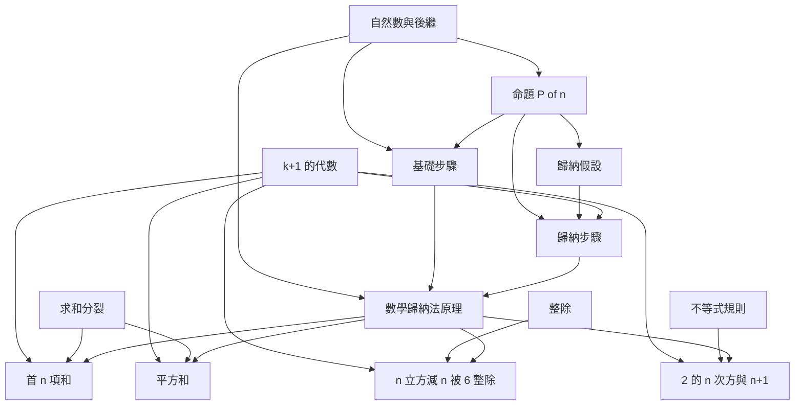

# DSE M2 數學歸納法入門：概念與定理依賴圖

這份圖服務香港中學文憑試延伸單元二（M2）「數學歸納法」入門。沒有課程檔案可供抽取，節點與邊都標成 inferred，並在第 8 節寫明哪些次序會隨學校或試題類型改變。

## 1) Scope and Inputs

- 輸入：主題短語「DSE M2 數學歸納法入門」。沒有 `00_syllabus.md` 或其他筆記檔。
- 地圖性質：inferred。標準骨架對齊公開課程裡「理解數學歸納法原理，並用以證明命題」這一條，再收錄最常見的三類目標：有限求和、整除、不等式。
- 依賴在這裡的意思：在學生能獨立完成 $B$ 之前，必須先會用 $A$。邊是前提，不是「同一章出現過」。只保留會卡住下一步的邊。
- 不收入：強歸納法、良序原理的形式證明、生成函數。這些不在這份入門地圖的範圍內；第 8 節說明若學校加講，邊會怎樣改。

## 2) Node Inventory

| id | label | type | source | confidence |
| --- | --- | --- | --- | --- |
| nat | 自然數與後繼 n 到 n+1 | concept | inferred | high |
| algebra | 把式子在 (k+1) 展開與因式分解 | concept | inferred | high |
| sigma | 求和記號與末項分裂 | concept | inferred | high |
| divisibility | 整除與抽出公因式 | concept | inferred | high |
| ineq | 不等式的保序加法與正數倍 | concept | inferred | medium |
| predicate | 依賴 n 的命題 P(n) | concept | inferred | high |
| base | 基礎步驟：驗證 P 在起點成立 | concept | inferred | high |
| hypothesis | 歸納假設：假定 P(k) 成立 | concept | inferred | high |
| step | 歸納步驟：由 P(k) 推出 P(k+1) | concept | inferred | high |
| pmi | 數學歸納法原理 | theorem | inferred | high |
| sum_n | 首 n 個正整數之和公式 | theorem | inferred | high |
| sum_sq | 首 n 個平方和公式 | theorem | inferred | high |
| div6 | n^3 - n 可被 6 整除 | theorem | inferred | high |
| ineq_exp | 2^n 大於或等於 n+1 | theorem | inferred | medium |

## 3) Dependency Edge Ledger

| from | to | rationale | confidence |
| --- | --- | --- | --- |
| nat | predicate | P(n) 的自變數必須是自然數，否則沒有「下一項」 | high |
| nat | base | 基礎步驟是在某個起始自然數上檢查 P | high |
| nat | pmi | 原理宣稱的是從起點起每一個自然數，而不只是有限幾個 | high |
| predicate | base | 基礎步驟的內容就是命題 P 在起點的那一個例子 | high |
| predicate | hypothesis | 歸納假設是「P(k) 為真」這句話，不是一個新命題 | high |
| predicate | step | 歸納步驟是 P 的兩個例子之間的蘊涵 | high |
| hypothesis | step | 步驟的第一行就是寫下並使用 P(k) | high |
| algebra | step | 把 P(k+1) 改寫成含 P(k) 的式子時要展開 (k+1) | high |
| base | pmi | 原理的第一句就是基礎步驟已經驗證 | high |
| step | pmi | 原理的第二句就是對所有 k，步驟都成立 | high |
| algebra | sum_n | 由 k(k+1)/2 走到 (k+1)(k+2)/2 要展開分子 | high |
| sigma | sum_n | 和到 k+1 必須拆成「和到 k」再加最後一項 | high |
| pmi | sum_n | 公式對每個 n 成立，是把原理用在這個 P 上 | high |
| algebra | sum_sq | 平方和的步驟要展開 (k+1)^2 與新的閉式 | high |
| sigma | sum_sq | 平方和同樣把末項 (k+1)^2 從求和裡拆出來 | high |
| pmi | sum_sq | 閉式對每個 n 成立，走的是同一條原理 | high |
| algebra | div6 | (k+1)^3 - (k+1) 要展開，才能看到它和 k^3 - k 相差什麼 | high |
| divisibility | div6 | 目標是 6 整除一個整數，不是等式 | high |
| pmi | div6 | 「對每個正整數都整除」靠原理從起點推到任意 n | high |
| algebra | ineq_exp | 步驟把 2^(k+1) 寫成 2 乘 2^k | medium |
| ineq | ineq_exp | 由 2^k 大於或等於 k+1 放大到 2^(k+1)，要用保序 | medium |
| pmi | ineq_exp | 不等式要對每個 n 成立，仍然是原理的一次應用 | medium |

## 4) Global Dependency Graph

求和與整除、不等式是三條平行的應用，匯合點在 `pmi`。不等式這條的信心較低，因為它更常出現在試題而不是原理本身。

## 5) Layered Learning Order (Topological View)

每一層只依賴更早的層。沒有環，所以不需要把循環簇單獨切開。

- `L0`: `nat`, `algebra`, `sigma`, `divisibility`, `ineq`
- `L1`: `predicate`
- `L2`: `base`, `hypothesis`
- `L3`: `step`
- `L4`: `pmi`
- `L5`: `sum_n`, `sum_sq`, `div6`, `ineq_exp`

`L0` 是歸納法開始之前就該會的學校代數。`L1` 到 `L3` 是把「一句依賴 n 的話」拆成可檢查的兩段。`L4` 才把兩段收成原理。`L5` 的四個定理互不依賴，可以按試題需要任選。

## 6) Bottlenecks and Keystone Results

- `predicate` 是概念瓶頸。基礎步驟、假設、步驟三條邊都從它出去；不會把一句話寫成 P(n)，後面的格式只是空行。
- `algebra` 是另一個高外出度概念。歸納步驟和 `L5` 的每一個目標都要在 (k+1) 上改寫式子。學生卡在歸納，很多時候是卡在展開，不是卡在「假設」這兩個字。
- `pmi` 是定理咽喉。四個目標定理都只透過它連回基礎步驟與歸納步驟。原理沒有單獨練過，求和公式和整除題會變成兩套互不相關的魔術。
- `sigma` 是求和這條支線的咽喉，但它不解鎖整除或不等式。只做求和題的學生會高估它；只做整除題的學生可以晚一點再補。
- `step` 外出度只有 1，但介於假設與原理之間，拿掉它，`pmi` 就沒有第二句。

## 7) Minimal Prerequisite Paths

下面每條都是一條能走到目標的前提鏈。應用題在最後一步還會再吃進 `L0` 的專用工具，鏈上已寫出那一條不能省的工具邊。

1. `pmi`：`nat` → `predicate` → `hypothesis` → `step` → `pmi`。基礎步驟 `base` 是並列的另一條入邊，不能用這條鏈取代。
2. `sum_n`：`sigma` → `sum_n` 太短。必要的長鏈是 `nat` → `predicate` → `hypothesis` → `step` → `pmi` → `sum_n`，並且 `algebra`、`sigma` 在最後一跳併入。
3. `sum_sq`：`algebra` → `step` → `pmi` → `sum_sq`，同時要有 `sigma` → `sum_sq`。不經過 `sum_n`。
4. `div6`：`divisibility` → `div6` 只說明目標是整除。證明鏈是 `nat` → `predicate` → `base` → `pmi` → `div6`，再加 `algebra` → `div6`。
5. `ineq_exp`：`ineq` → `ineq_exp` 與 `pmi` → `ineq_exp`。`ineq` 本身停在 `L0`，信心是 medium，因為有些班把不等式只當選做題。

## 8) Ambiguities and Alternative Edges

- `sum_n` → `sum_sq` 可以當成另一條邊：有人在化簡平方和的步驟時先用首 n 項和。直接對平方和做歸納並不需要那條公式。這是學校習慣，信心 low，不放進邊表。
- `div6` 也可以完全不走歸納：n^3 - n = (n-1)n(n+1) 是三個連續整數，所以被 6 整除。那是一條平行的因式路徑，不是這張圖裡的前提。入門班若先教因式，學生會覺得歸納是多餘的；DSE 要的是「用歸納寫出 P(k+1)」。信心 low。
- 強歸納法若被加進課程，應放在 `pmi` 之後，而不是放在 `L0`。本圖不設這個節點。有些整除題用強歸納更自然，但 M2 入門的標準寫法仍是普通歸納。信心 low。
- `ineq` 與 `ineq_exp` 標成 medium：原理與求和、整除在課程敘述裡更穩，不等式是試卷上的常見題型。若某校不作不等式，刪掉這三條 medium 邊不會影響 `L0` 到 `L4`。
- `nat` → `pmi` 與 `nat` → `base` 有重疊。保留兩條，是因為「起點是自然數」和「結論覆蓋所有其後的自然數」不是同一句話。若想把圖收短，可以只留 `nat` → `base`，再靠 `base` → `pmi` 傳遞；那會少掉「原理的量詞是全體自然數」這個直接前提。信心 medium，本次不刪。

## 9) Study Plans From the Map

1. **直覺先行。** 沿 `L0` 的 `nat` 進入 `L1` `predicate`，在 `L2` 分開練 `base` 與 `hypothesis`，再在 `L3` 把假設用進 `step`。`L4` 的 `pmi` 此時只是把已經做過的兩段收成一句話。`L5` 先做 `sum_n`，因為末項分裂最容易看見。
2. **定理先行。** 先讀 `L5` 的 `sum_n` 陳述，發現自己寫不出「和到 k+1」。退回 `L4` `pmi`，再退回 `L3` `step` 與 `L2` `hypothesis`。`algebra` 與 `sigma` 只在卡殼時從 `L0` 抽出來，不先上完整個代數複習。
3. **考試取向。** `L0` 只複習 `algebra`、`sigma`、`divisibility`。然後 `L4` `pmi` 的書寫格式（基礎、假設、步驟、結論）各寫一次。`L5` 按出現頻率做 `sum_n`、`div6`，有餘力再做 `sum_sq` 與 `ineq_exp`。`ineq` 可以留到最後，因为它是 medium，而且不阻塞前三題。

## 10) Sanity Check Summary

- 節點 14 個（概念 9，定理 5）。
- 邊 22 條。其中 19 條 high，3 條 medium，全部指向不等式應用。
- 環：0 個循環簇。分層 `L0` 到 `L5` 是一條幹，到原理之後分成四條互不依賴的應用。

形狀說明：這門入門不是一張網，而是一座漏斗。`L0` 的代數工具很寬，真正把課程接成一門課的是中間的 `predicate`、`step` 與 `pmi`。過了原理，求和、整除、不等式不再互相依賴，所以刷題可以分題型，但書寫格式不能分家。不等式整條可以整段拆走，其餘結構仍然是有向無環圖。
